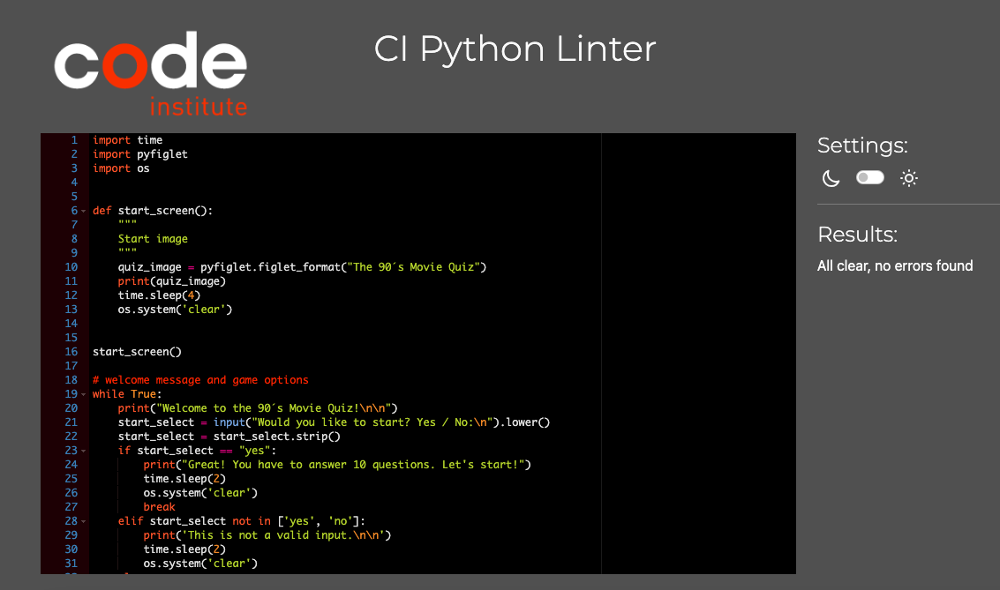

# The 90´s Movie Quiz

The quiz is dedicated to movie fans of the 90s. This quiz will refresh the memory of movie lovers of the last century, giving you the opportunity to remember the names of your favorite actors and the films in which they starred.

You can check out the website [here](https://the-90s-movie-quiz-a101c5992da4.herokuapp.com/)!

### Validator Testing 

- Python
  - No errors were returned when passing through the 

### Unfixed Bugs

There were no unfixed bugs in this app.

## Technologies Used

### Workspace

I did all the work in Codeanywhere, and at the same time I used PyCharm as a draft and sometimes wrote the code there, and then copied it from there and pasted it into Codeanywhere.

### Languages Used

HTML, Python

### Frameworks, Libraries & Programs Used

* [Github](https://github.com/) - To save and store the files for the website.
* [Heroku](https://www.heroku.com) - Deploy platform
* [Lucid](https://lucid.app) - Write flow chart
* [W3Schools](https://www.w3schools.com/) - Study material about python 

## Deployment

Heroku

* The project was deployed to Heroku in the following manner:

1. Firstly you need to sign up on the Heroku website.
2. There after choose new and "create New App".
3. Give the app a name: the-90s-quiz-movie.
4. Choose a region: Europe.
5. Go to settings and add following buildpacks: "Python and Node.js".
6. Go to deploy, see Deployment Method and select GitHub.
7. To connect your Heroku app to your code in a Github repository, you need to enter the name of your repository and click on the "Search" button. After that click on button “Connect” when it appears.
8. Select the branch from which you want to build your application. Optionally, click "Enable Automatic Deployment" to ensure the application is up to date in your GitHub repository.
9. You have to wait until the app is build. When it wiil be done it will appear an “App was successfully deployed” message and after that you will see a "View" button. When you click on this button you will see your app deployed.
10. You can go to my deployed app here: [The 90´s Movie Quiz](https://the-90s-movie-quiz-a101c5992da4.herokuapp.com/)

## Credits 

I was inspired by this video (https://www.youtube.com/watch?v=yriw5Zh406s),these tutorial: (https://realpython.com/python-quiz-application/) and "The Love Sandwiches Project" by Anna Greaves.

### Content 

- All content for the site was written by myself.