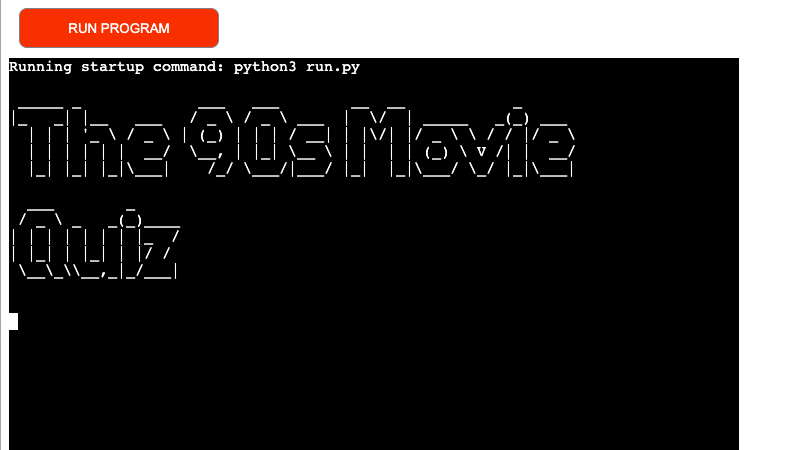
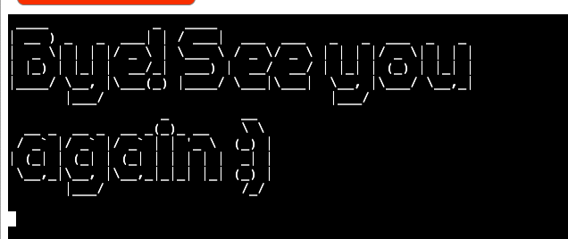

# The 90´s Movie Quiz

The quiz is dedicated to movie fans of the 90s. This quiz will refresh the memory of movie lovers of the last century, giving you the opportunity to remember the names of your favorite actors and the films in which they starred. The quiz consists of 10 questions.

You can check out the website [here](https://the-90s-movie-quiz-a101c5992da4.herokuapp.com/)!

## Design
I used program "Lucid" to write flow chart.

## Features

When compiling the game, I took into account the ability to select answer options with both capital and small letters, so that there would be no error when entering. You can also, for example, put a space next to the answer option and indicate the option, the game will work correctly.

### Existing Features

__Start__

- The quiz begins with a start image "The 90s Movie Quiz"

- Then the player is given the opportunity to play the quiz or refuse. If the player agrees to start the quiz by entering the word “Yes”, then the message “Great! You have to answer 10 questions. Let's start!” is displayed and quiz begins.

- If the player enters the word “No”, a splash screen appears with the words “Very sorry” and the quiz ends.

- If the player enters any value other than the "Yes or No" list, he receives a message that this is an invalid input and is returned back to being asked to enter a Yes or No answer.
When the player finally selects an option from this list, the game will either start or end depending on the answer chosen.

__Questions and answers__

- The player is given the option of choosing the answer A, B, C or D. If the player enters the correct answer, he receives a message that he answered correctly and the game continues.

- If the answer is incorrect, the player receives a message that the answer is wrong, and the quiz also continues.

- If the player specifies any other value not from the list A, B, C or D, then he receives a message that this is an invalid choice and returns back to the question and is again asked to choose an answer option from the list A, B, C or D. When the player finally selects an option from this list, the quiz continues.

__End of the quiz__

- After the player answers all 10 questions, he will receive a message about the game score, that is, how many questions he answered correctly.

- This is followed by a splash screen with the words: “The End” and then the choice to start the game again is displayed.

- If the player agrees to start the game again, then he again gets to the very first question. If the player refuses, then a splash screen with the words “Bye! See you again” is displayed and after that the game ends.

- If the player enters any value other than the "Yes or No" list, he is prompted that this is an invalid input and is returned back to being asked to enter a Yes or No answer.
When the player finally selects an option from this list, the quiz will either start over or end, depending on the answer chosen.

### Validator Testing 

- Python
  - No errors were returned when passing through the 

### Unfixed Bugs

There were no unfixed bugs in this app.

## Technologies Used

### Workspace

I did all the work in Codeanywhere, and at the same time I used PyCharm as a draft and sometimes wrote the code there, and then copied it from there and pasted it into Codeanywhere.

### Languages Used

HTML, Python

### Frameworks, Libraries & Programs Used

* [Github](https://github.com/) - To save and store the files for the website.
* [Heroku](https://www.heroku.com) - Deploy platform
* [Lucid](https://lucid.app) - Write flow chart
* [W3Schools](https://www.w3schools.com/) - Study material about python 

## Deployment

Heroku

* The project was deployed to Heroku in the following manner:

1. Firstly you need to sign up on the Heroku website.
2. There after choose new and "create New App".
3. Give the app a name: the-90s-quiz-movie.
4. Choose a region: Europe.
5. Go to settings and add following buildpacks: "Python and Node.js".
6. Go to deploy, see Deployment Method and select GitHub.
7. To connect your Heroku app to your code in a Github repository, you need to enter the name of your repository and click on the "Search" button. After that click on button “Connect” when it appears.
8. Select the branch from which you want to build your application. Optionally, click "Enable Automatic Deployment" to ensure the application is up to date in your GitHub repository.
9. You have to wait until the app is build. When it wiil be done it will appear an “App was successfully deployed” message and after that you will see a "View" button. When you click on this button you will see your app deployed.
10. You can go to my deployed app here: [The 90´s Movie Quiz](https://the-90s-movie-quiz-a101c5992da4.herokuapp.com/)

## Credits 

I was inspired by this video (https://www.youtube.com/watch?v=yriw5Zh406s),these tutorial: (https://realpython.com/python-quiz-application/) and "The Love Sandwiches Project" by Anna Greaves.

### Content 

- All content for the site was written by myself.